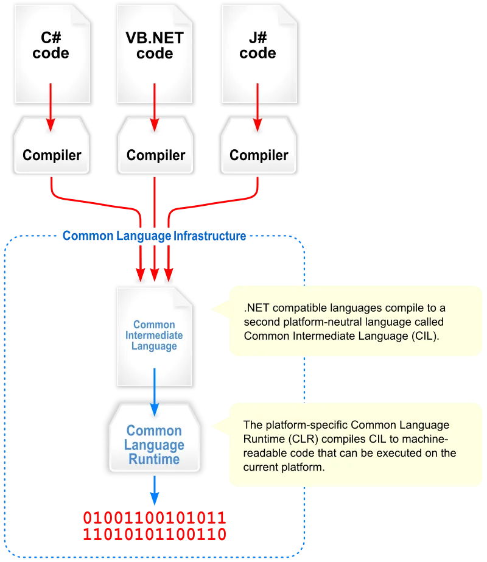
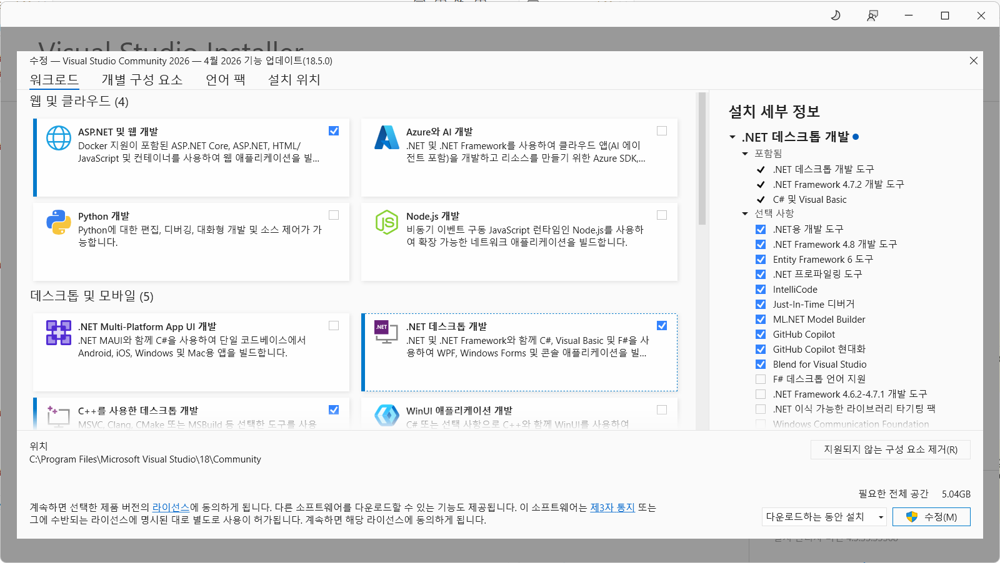
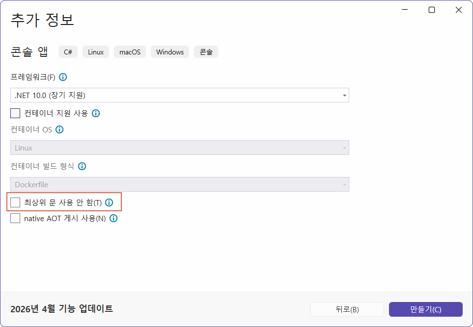
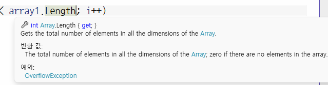
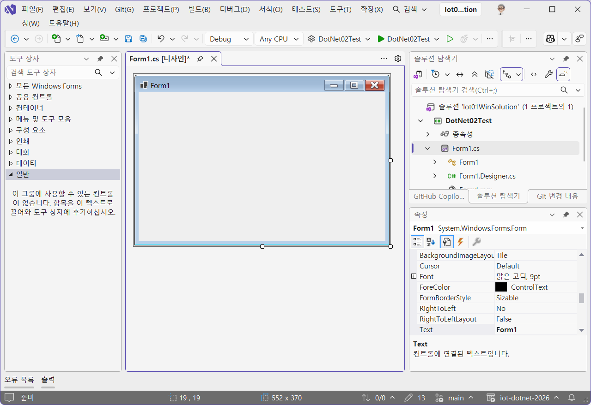
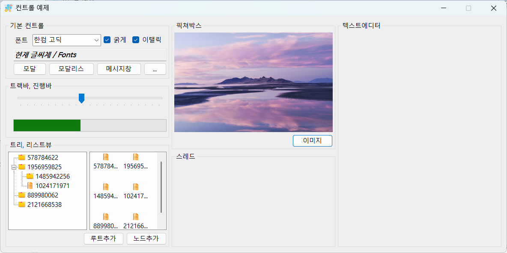

# iot-dotnet-2026
IoT 개발자 닷넷 리포지토리(기본,중급,응용,프로젝트)

## 1일차

### C# 기본
- 현 세대 프로그래밍언어 랭킹 5위
- C++,파이썬,자바와 같은 객체지향 언어
- MS 윈도우에 종속적이었지만 현재 멀티플랫폼 변환 중
- MAUI(구 자마린)으로 모바일앱 개발 가능
- 유니티 게임 엔진 기본 스크립트 채택
- 스마트팩토리,KIOSK 개발 등에 많이 활용

### C#은 닷넷 프레임워크 위에서 동작함
- 자바는 버츄얼머신(VM) 위에서 동작하면 C#은 닷넷 프레임워크(VM)위에서 동작함
- .NET(dotNET) 프레임워크의 구조를 따르면 무슨 언어든지 동작가능
    - C#,VB,J#,F#,C++,NET,Python...
- 
- 출처 : https://wikidocs.net/227163

- 버전명칭
    - .NET Framwork > .NET Core > .NET 5.0 이상

### 절차적 프로그래밍 vs 객체지향 프로그래밍
- 절차적 : 순서대로 수행하도록 프로그래밍을 구현하는 것
- 객체지향 : 모든 것을 객체로 선언해서 메서드로 동작,각 객체별로 메시지를 전달하는 형태로 프로그래밍을 구현하는 것
- 포괄적 의미 : 절차적 프로그래밍을 하면서 객체를 최대한 사용하는 방식

### C# 개발분양
- 윈도우 프로그램 : 윈 앱(Application -> App)
- 웹 앱 : ASP(Active Server Page).NET <--> Spring(Java Server Page)
    - MacOS,Linux,Window 모두 가능
- 유니티 : 게임 + 디지털트윈(산업계)
    - 크로스플랫폼(모바일까지)
- IoT 연동 : 아두이노, 라즈베리파이 가능

### C# 언어 난이도
- C > C++ > Java > C# > Python

### C# 기본 구현
1. visual Studio 실행
2. C#이 없으면 추가 기능 설치
    - ASP.NET 및 웹 개발
    - .NET 데스크톱 개발
    - unity 게임 개발
    - 

3. visual studio 재실행
4. 새 프로젝트 만들기
5. 언어 C#으로 선택
6. 콘솔 앱 선택
7. 새 프로젝트 구성 : 프로젝트 명,저장 위치,솔류션 이름 지정
8. 추가 정보 : 프레임워크 선택, Do not use top-level statement 선택여부
    - 
9. 만들기 버튼 클릭

    ```cs
    // 최신방식 - 처음 학습시에 도움이 안되는 방식
    Console.WriteLine("Hello, World!");
    ```

10. 추가 정보에서 `최상위 문 사용 안함`을 체크할 것

### C# 기본 문법
- 기본 문법
- 
    ```cs
    // C#은 네임스페이스 내 동작
    // Python에 import로 불러올수 있는 패키지와 동일
    namespace ConsoleApp2
    {
        // C# OOP. 모든 것은 객체
        internal class Program
        {
            // 기본 진입점(EntryPoint) 메서드(C#은 함수라고 부르지 않음)
            static void Main(string[] args)
            {
                // 빌트인 클래스 콘솔 내의 WriteLine 메서드로 콘솔에 문자열 출력
                Console.WriteLine("Hello, C#!");
            }
        }
    }
    ```
- 주석 : 한 줄 주석(//), 여러줄 주석(/* */)

- 변수와 타입
    - 초기화 : `접근제한자 타입 변수명`
    - sbyte,byte,short,ushort,int,unit,long,ulong
    - float,double,decimal,char,bool
    - 참조타입(클래스) : class,intereface,array,string
        - 대문자로 시작하는 타입명
        - Boolean,Int16~128,Single,Double
    - 변수 선언은 C와 동일
    - 
    - 형변환
        - 묵시적 형변환 : 작은 타입 변수를 큰 타입의 변수로 옮길때
        - 명시적 형변환 : `(타입)` 지정
    - var : 가변타입, javascript의 var와 동일, C++의 auto와 동일
        
- 연산자
    - C/C++과 동일

- 제어문
    - if,for,while,swith까지 동일
    - foreach는 컬렉션 이후

- 메서드
    - C/C++ 함수와 동일

- 객체지향
    - C++,Python 객체지향 클래스 내용과 동일
    - 클래스 : 명사와 동사의 집합
        - 명사 : 멤버변수, 속성(Property) Get or Set
        - 동사 :멤버함수,메서드(Method)
    ```cs
    class Person{
        public string Name;
        
        public void Eat(){
            Console.WriteLine(Name + "먹는다");
        
        }
    }
    static void Main(){
        Person p1 = new Person();
        p1.Name = "홍길동";
        p1.Eat();
    }
    ```
    - 생성자 : 클래스명과 동일한 특수메서드
    - 오버로딩 지원 : 메서드 파라미터 갯수가 다르면 가능 
    - 상속 : 당연하게 사용가능, 멀티클래스 상속 불가
        - 다중 인터페이스 구현으로 멀티클래스 상속 대체


- 클래스 속성에서
    - get : 속성의 값을 가져올 수 있음
    - set : 속성의 값을 변경할 수 있음
    - get만 있으면 : 속성값을 변경 불가. 가져올 수만 있음
    - set만 있으면 : 속성값을 변경만 가능
    - get;set; : 속성값 변경 및 가져오기 가능

- 컬렉션
    - 배열,리스트 등 여러요소를 묶어서 사용하는 구조
    - 배열보다 컬렉션을 사용할 것

    - 
    - foreach : python `for (i in range(n))`과 동일

- 파일 입출력

### MSDN(MicroSoft Developer Network)
- https://learn.microsoft.com/ko-kr/dotnet/csharp/

### C# 프로그래밍
- C#으로 프로그램을 구현한다는 뜻
    - winApp webApp unity maui WPF 개발함
    - GUI(Graphic User Interface) 활용

### 윈앱

- winForms , Window Application, GUI ... => `WinApp`으로 통일
    - windows forms : 가장 오래된 윈앱개발방식
    - WPF : 좀 더 최신의 윈앱개발 방식

- 윈앱 개발에는 각 두개로 구분되어 있음
    - .NET Framework : .NET Framework 4.8 이전 구형 개발방식
    - 기본 : .NET 5.0 이상의 최신 개발방식

### 윈폼즈 앱 구현
1. 새 프로젝트
2. 프로젝트명,위치,솔루션 명 지정 다음
3. 프레임워크 .NET 10.0 선택 후 만들기
4. IDE 툴에서 평션키 F4로 속성창 오픈
5. 보기 > 도구상자 
6. 기본 개발 화면
    - 
7. 저장할 때는 항상 ctrl shift s 모두 저장
8. 도구상자의 컨트롤을 디자인 화면으로 드래그해서 구성
9. 컨트롤의 속성 변경으로 디자인 적용
10. 컨트롤의 이벤트 추가로 기능 구현
11. 디자이너화면 `F7` <--> 비하인드 코드 `shift + f7`
12. 속성버튼 `alt + enter`

### 윈폼즈앱 용어
- 모달/모달리스 : 부모창과 자식창의 관계
    - 모달(Modal) : 모달창 종료전에는 부모창 제어불가
    - 모달리스(Modaless) : 서브창 종료와 관계없이 부모창 제어가능

- 속성 변경방법
    - 디자인타입 변경 : [디자인] 작업 시 속성창의 속성값 변경
    - 런타임 변경 : 비하인드 코드내에서 속성값을 변경, 실행 시 변경되는 것
- 
