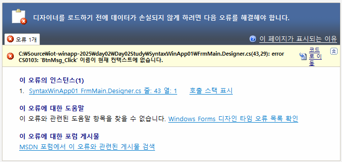
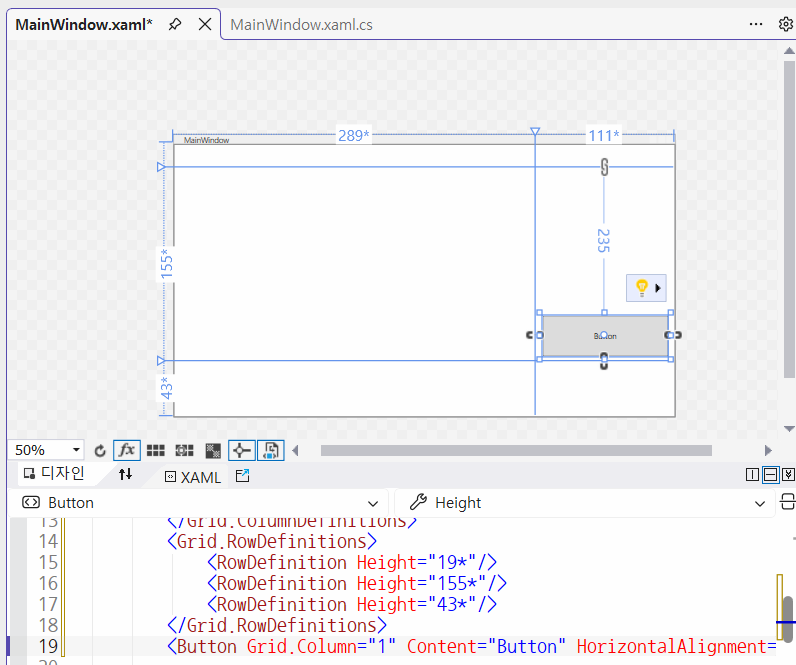
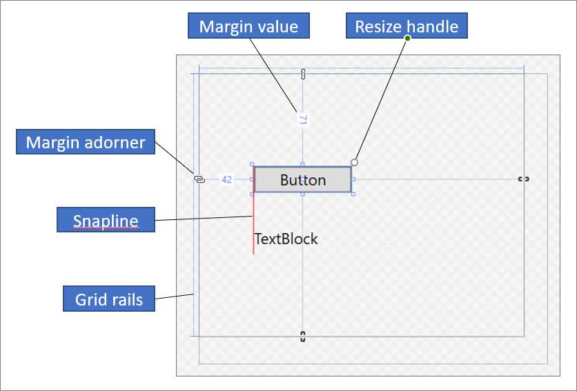
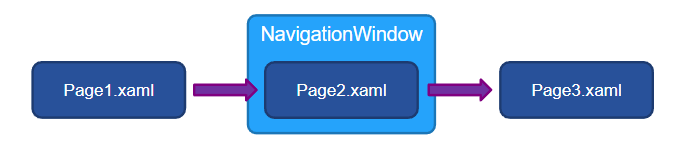
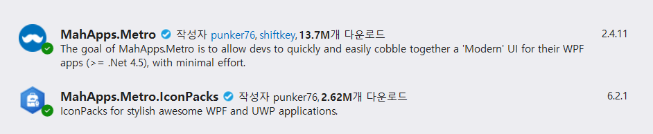
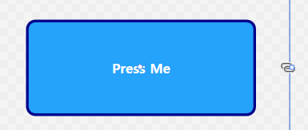
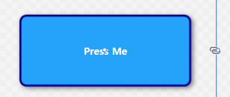
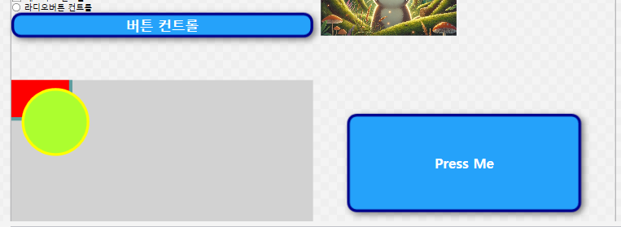
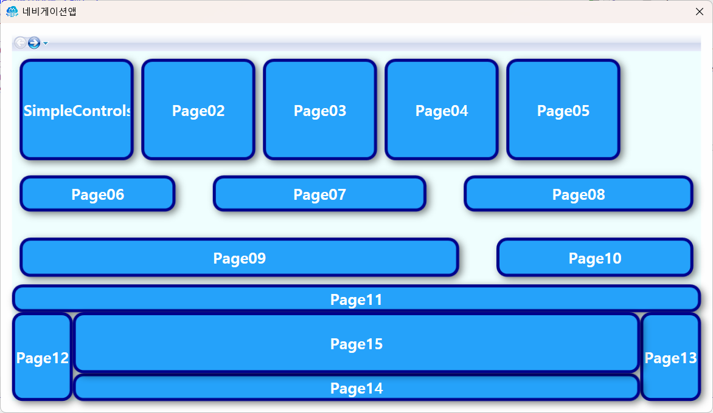

# iot-dotnet-2026
IoT 개발자 닷넷 리포지토리(기본,중급,응용,프로젝트)

### C# 기본
- 현 세대 프로그래밍언어 랭킹 5위
- C++,파이썬,자바와 같은 객체지향 언어
- MS 윈도우에 종속적이었지만 현재 멀티플랫폼 변환 중
- MAUI(구 자마린)으로 모바일앱 개발 가능
- 유니티 게임 엔진 기본 스크립트 채택
- 스마트팩토리,KIOSK 개발 등에 많이 활용

### C#은 닷넷 프레임워크 위에서 동작함
- 자바는 버츄얼머신(VM) 위에서 동작하면 C#은 닷넷 프레임워크(VM)위에서 동작함
- .NET(dotNET) 프레임워크의 구조를 따르면 무슨 언어든지 동작가능
    - C#,VB,J#,F#,C++,NET,Python...
- 
- 출처 : https://wikidocs.net/227163

- 버전명칭
    - .NET Framwork > .NET Core > .NET 5.0 이상

### 절차적 프로그래밍 vs 객체지향 프로그래밍
- 절차적 : 순서대로 수행하도록 프로그래밍을 구현하는 것
- 객체지향 : 모든 것을 객체로 선언해서 메서드로 동작,각 객체별로 메시지를 전달하는 형태로 프로그래밍을 구현하는 것
- 포괄적 의미 : 절차적 프로그래밍을 하면서 객체를 최대한 사용하는 방식

### C# 개발분양
- 윈도우 프로그램 : 윈 앱(Application -> App)
- 웹 앱 : ASP(Active Server Page).NET <--> Spring(Java Server Page)
    - MacOS,Linux,Window 모두 가능
- 유니티 : 게임 + 디지털트윈(산업계)
    - 크로스플랫폼(모바일까지)
- IoT 연동 : 아두이노, 라즈베리파이 가능

### C# 언어 난이도
- C > C++ > Java > C# > Python

### C# 기본 구현
1. visual Studio 실행
2. C#이 없으면 추가 기능 설치
    - ASP.NET 및 웹 개발
    - .NET 데스크톱 개발
    - unity 게임 개발
    - 

3. visual studio 재실행
4. 새 프로젝트 만들기
5. 언어 C#으로 선택
6. 콘솔 앱 선택
7. 새 프로젝트 구성 : 프로젝트 명,저장 위치,솔류션 이름 지정
8. 추가 정보 : 프레임워크 선택, Do not use top-level statement 선택여부
    - 
9. 만들기 버튼 클릭

    ```cs
    // 최신방식 - 처음 학습시에 도움이 안되는 방식
    Console.WriteLine("Hello, World!");
    ```

10. 추가 정보에서 `최상위 문 사용 안함`을 체크할 것

### C# 기본 문법
- 기본 문법
- 
    ```cs
    // C#은 네임스페이스 내 동작
    // Python에 import로 불러올수 있는 패키지와 동일
    namespace ConsoleApp2
    {
        // C# OOP. 모든 것은 객체
        internal class Program
        {
            // 기본 진입점(EntryPoint) 메서드(C#은 함수라고 부르지 않음)
            static void Main(string[] args)
            {
                // 빌트인 클래스 콘솔 내의 WriteLine 메서드로 콘솔에 문자열 출력
                Console.WriteLine("Hello, C#!");
            }
        }
    }
    ```
- 주석 : 한 줄 주석(//), 여러줄 주석(/* */)

- 변수와 타입
    - 초기화 : `접근제한자 타입 변수명`
    - sbyte,byte,short,ushort,int,unit,long,ulong
    - float,double,decimal,char,bool
    - 참조타입(클래스) : class,intereface,array,string
        - 대문자로 시작하는 타입명
        - Boolean,Int16~128,Single,Double
    - 변수 선언은 C와 동일
    - 
    - 형변환
        - 묵시적 형변환 : 작은 타입 변수를 큰 타입의 변수로 옮길때
        - 명시적 형변환 : `(타입)` 지정
    - var : 가변타입, javascript의 var와 동일, C++의 auto와 동일
        
- 연산자
    - C/C++과 동일

- 제어문
    - if,for,while,swith까지 동일
    - foreach는 컬렉션 이후

- 메서드
    - C/C++ 함수와 동일

- 객체지향
    - C++,Python 객체지향 클래스 내용과 동일
    - 클래스 : 명사와 동사의 집합
        - 명사 : 멤버변수, 속성(Property) Get or Set
        - 동사 :멤버함수,메서드(Method)
    ```cs
    class Person{
        public string Name;
        
        public void Eat(){
            Console.WriteLine(Name + "먹는다");
        
        }
    }
    static void Main(){
        Person p1 = new Person();
        p1.Name = "홍길동";
        p1.Eat();
    }
    ```
    - 생성자 : 클래스명과 동일한 특수메서드
    - 오버로딩 지원 : 메서드 파라미터 갯수가 다르면 가능 
    - 상속 : 당연하게 사용가능, 멀티클래스 상속 불가
        - 다중 인터페이스 구현으로 멀티클래스 상속 대체


- 클래스 속성에서
    - get : 속성의 값을 가져올 수 있음
    - set : 속성의 값을 변경할 수 있음
    - get만 있으면 : 속성값을 변경 불가. 가져올 수만 있음
    - set만 있으면 : 속성값을 변경만 가능
    - get;set; : 속성값 변경 및 가져오기 가능

- 컬렉션
    - 배열,리스트 등 여러요소를 묶어서 사용하는 구조
    - 배열보다 컬렉션을 사용할 것

    - 
    - foreach : python `for (i in range(n))`과 동일

- 파일 입출력

### MSDN(MicroSoft Developer Network)
- https://learn.microsoft.com/ko-kr/dotnet/csharp/

### C# 프로그래밍
- C#으로 프로그램을 구현한다는 뜻
    - winApp webApp unity maui WPF 개발함
    - GUI(Graphic User Interface) 활용

### 윈앱

- winForms , Window Application, GUI ... => `WinApp`으로 통일
    - windows forms : 가장 오래된 윈앱개발방식
    - WPF : 좀 더 최신의 윈앱개발 방식

- 윈앱 개발에는 각 두개로 구분되어 있음
    - .NET Framework : .NET Framework 4.8 이전 구형 개발방식
    - 기본 : .NET 5.0 이상의 최신 개발방식

### 윈폼즈 앱 구현
1. 새 프로젝트
2. 프로젝트명,위치,솔루션 명 지정 다음
3. 프레임워크 .NET 10.0 선택 후 만들기
4. IDE 툴에서 평션키 F4로 속성창 오픈
5. 보기 > 도구상자 
6. 기본 개발 화면
    - 
7. 저장할 때는 항상 ctrl shift s 모두 저장
8. 도구상자의 컨트롤을 디자인 화면으로 드래그해서 구성
9. 컨트롤의 속성 변경으로 디자인 적용
10. 컨트롤의 이벤트 추가로 기능 구현
11. 디자이너화면 `F7` <--> 비하인드 코드 `shift + f7`
12. 속성버튼 `alt + enter`

#### 트러블슈팅

- Visual Studio 2022 이상 윈폼즈 개발시 디자인화면에서 버튼을 더블클릭 이벤트 추가할 시 발생하는 오류
- Desinger.cs에 생성되는 이벤트 선언문과 .cs파일 이벤트핸들러가 생성되지 않아서 발생

#### 첫번째 방법
1. Designer.cs 내 `windows form Desinger generated code`영역을 확장
2. 빨간색 밑줄이 그인 오류난 이벤트 이름 삭제
3. VS시작

#### 두번째 방법
1. Designer,cs 냐 `windows form Designer generated code` 영역을 확장
2. 빨간색 밑줄 오류난 이벤트에서 `Alt+Enter`
3. 메서드 생성
4. .cs로 메서드

### 윈폼즈앱 용어
- 모달/모달리스 : 부모창과 자식창의 관계
    - 모달(Modal) : 모달창 종료전에는 부모창 제어불가
    - 모달리스(Modaless) : 서브창 종료와 관계없이 부모창 제어가능

- 속성 변경방법
    - 디자인타입 변경 : [디자인] 작업 시 속성창의 속성값 변경
    - 런타임 변경 : 비하인드 코드내에서 속성값을 변경, 실행 시 변경되는 것
- 

### 스레드 사용
- 윈앱 자체가 UI 스레드 사용
- 반복작업을 스레드없이 수행하면 UI 스레드와 충돌발생 -> 응답없음
- 
- C#에서 스레드 사용 방법
     - 스레드 클래스 사용 - 개발자 코딩 필요 
     - 백그라운드워커 클래스 사용 - 필수요소만 처리해주면 됨 

- 백그라운드워커 구현법
    1. 워커명_DoWork - 첫 실행하는 부분
    2. 워커_ProgressChanged - 진행사항 UI 스레드로 전달
    3. 워커_RunWorkerCompleted - 스레드 완료 후 처리할 것들

- async/await 키워드로 진행
    - 비동기처리를 지원하는 메서드만 사용가능

- 

### 비동기 처리 앱
- 비동기로 호출할 메서드 앞에 await 키워드 추가
- 비동기메서드 호출하는 부모ㅓ메서드 접근제어 키워드와 리턴값 사이에 async 추가
- 동기화 복사는 복사기능 도중, 다른 이벤트 사용불가
- 비동기화 복사는 다른 이벤트 가능
- 아주 간단하게 스레드 처리가 가능
- 일반메서드를 비동기메서드로 변경
- 리턴값이 있을 때 변경 long -> Task<long>

- 

### DB연동 앱 
- MySQL bookrentalshop 연동

#### 외부 라이브러리 활용
- 윈폼즈 앱 개발시 직접 디자인이 어려움
- 3rd 파티사에서 여러 라이브러리 제공
- 예전에는 따로 설치, 내 프로젝트에 붙여넣기
- NuGet Package 존재 - Python pip와 동일한 기능
- https://www.nuget.org/packages 에서 설치방법 확인

#### NuGet 설치 순서
1. 프로젝트 마우스, 오른쪽 버튼 > NuGet 패키지관리 클릭
2. 찾아보기에서 필요한 라이브러리 검색
3. 패키지 세부사항 > 종속성 , 현재 프로젝트 버전에서 사용여부 확인
4. 설치 클릭, 변경내용 미리보기 확인
5. 라이선스 허용여부 

### 일반 웹 서비스
- HTML,CSS,Js 사용 웹호마녀 개발 +백엔드
- ASP.NET, Spring Boot 등을 사용 기본적인 웹서버 개발
- 네이버,구글,기업 홈페이지..

### ASP.NET
- 새 프로젝트 - ASP.NET Core 웹앱(MVC) 선택
- 프로젝트명,위치,솔루션 명 입력 다음
- 프레임워크 선택,인증유형없음, HTTPS 체크,최상위문 사용안함 체크
- 나머지는 기존 상태 그대로 만들기
- 

### ASP.NET API서버 
1. 새 프로젝트 - ASP.NET core 웹 API
2. 위와 동일
3. OpenAPI 컨트롤러 사용 체크 나머지 동일
4. 서버 실행
    - Get으로 데이터 조회
    - 서버 상태 확인
    - 

## 유니티
- 게임엔진+ : Unity(C#),UNreal(C++),Blender(Python), Godot Engine(C#)
- Unity 특장점
    - 구현 쉽다 : 툴 실행이 빠르다
    - 인더스트리 분야 진입 속도가 빠름
    - 캐쥬얼 게임 , 디지털 트윈

### 유니티 설치
- https://unity.com/ 에서 회원가입 및 다운로드
- 유니티 허브 설치
- 유니티 허브 실행 후 로그인 
- Personal Licence 승인하면 활성화 
- install -> editor 설치

### 유니티 프로젝트 실행
- 유니티 허브
- 3D (built-in Render pipeline) 선택
- Project name,location 확인
- create project 클릭
- unity editor 팝업

### 신 에디터 키보드/마우스 동작
- 키보드 방향키 
    - 좌우 : 화면 이동
    - 위아래 : 줌인/아웃
- Shift : 방향이동 가속
- 마우스
    - 왼쪽 버튼 : 오브젝트 선택
    - 오른쪽 버튼 : 시점 변환
    - 스크롤 : 줌인/아웃
    - 스크롤 버튼 : 시점 이동

### Unity 구현 순서
- 오브젝트 생성
    - 바닥 Plane, Cube 변형
    - 배경 오브젝트
    - 캐릭터 오브젝트
- 오브젝트 위치,회전,스케일 조정
- 머티리얼 사용, 텍스쳐 적용
- 애니메이터로 애니메이션 적용
- 스크립트 생성
- 오브젝트 스크립트 할당
- 충돌 감지 적용

### 키오스크앱
- 결제이전까지 동작하는 버전
- WPF를 사용해서 구현

### OpenAPI연동 앱
- 미세먼지 모니터링앱
- 국가교통정보 CCTV뷰 앱
- IoT 센서값 모니터링 앱

### WPF
- Windows Presentation Foundation - UI 프레임워크
    - WinForms보다 더 현대적인 UI 제작 가능
    - 애니메이션, 2D/3D 그래픽 지원
    - 데이터(DB,JSON) 바인딩 기능 강력
    - XML(QXML 기반 UI설계방식)기반 디자인,로직과 완전분리 가능
    - UI와 로직의 완전분리를 위해 MVM패턴 사용이 쉬움 

### WPF 특징
- XAML 사용 - 안드로이드,Qt등의 기존 XML 기반의 디자인이 가능
    - 드래그앤드랍으로 기본 디자인 후 세밀한 조정은 코딩으로 가능
    - 

- GPU 가속 렌더링
    - WinForms, CPU기반 GDI+렌더링으로 복잡하고 느렸음
    - DirectX 기반으로 그래픽 처리가 부드럽다
    - 애니메이션, 3D , 반투명효과, 그림자,블러...

- 스타일,테마 적용이 쉬움
    - XML 기반,HTML의 CSS와 유사
    - 디자인 자유도가 아주 높음

### WPF 프로젝트 구성
- App.xaml : 프로그램 시작점에 들어가는 스타일 (static void Main과 유사)
    - App.xaml.cs : 프로그램 시작점에 들어가는 초기화 로직
- MainWindow.xaml : 메인폼 디자인과 동일
    - MainWindow.xaml.cs : 코드비하인드

### WPF mainWindow.xaml 디자인 순서
1. `Grid`,StackPanel,Canvas 등으로 화면 구역 나누기
2. 구역별로 컨트롤 배치
3. xaml 코드 수정
    - Blend for Visual Studio에서 디자이너가 작업
    - Visual Studio에 반영
4. xaml.cs 비하인드코드 작성
    - 모든 객체는 Margin(외부여백),Padding(내부여백)
    - Achoring 표시 : 체인이 연결/끊김으로 표시
    
    - 그리드를 나누는 표시
    - 각 나눈 영역은 n배로 표시
    - *가 없으면 픽셀 고정 사이즈
    
5. 새 창 추가
6. App.xaml에서 시작하는 창을 변경
7. xaml은 대부분 도구상자,속성을 피하는 것보다 직접 xaml코딩으로 디자인 많이함

### 네비게이션앱
- 하나의 창에 여러 페이지를 전환하면서 사용하는 방식앱



#### 이미지, 동영상
- 이미지 - 솔루션 탐색기 선택
    - 속성 > 빌드 작업 `리소스` 변경
- 동영상 - 솔루션 탐색기 선택
    - 속성 > 빌드 작업 `내용`으로 변경
    - 출력 디렉토리로 복사 `새 버전이면 복사`, `항상 복사` 중 선택
    - bin 아래 debug/release 폴더에 복사
    - MediaElement Source 할당작업을 코드비하인드에서 처리

#### 컨트롤 디자인

- 일반 버튼 원본

```xml
<Button Margin="50" Click="Button_Click" Content="Press Me">
</Button>
```


- Button.Template 속성을 변경

```xml
<Button Margin="50" Click="Button_Click" Content="Press Me">
    <Button.Template>
        <ControlTemplate TargetType="Button">
            <Grid>
                <Rectangle RadiusX="12" RadiusY="12" 
                           Fill="#25A3FB" Stroke="DarkBlue" StrokeThickness="4" />
                <Label Content="{TemplateBinding Content}" Foreground="White" FontSize="20" FontWeight="ExtraBold"                                   
                       HorizontalAlignment="Center" VerticalAlignment="Center"/>
            </Grid>
        </ControlTemplate>
    </Button.Template>
</Button>
```



- ControlTemplate TargetType을 Button 지정
- 보통 Grid(객체들이 겹쳐서 표현되기 때문) 안에 여러 객체를 위치
- 부모객체(Button)의 속성을 가져다 쓰려면 `{TemplateBinding 속성명}` 형태로 설정

```xml
<Button Margin="50" Click="Button_Click" Content="Press Me">
    <Button.Template>
        <ControlTemplate TargetType="Button">
            <Grid>
                <Rectangle RadiusX="12" RadiusY="12" 
                           Fill="#25A3FB" Stroke="DarkBlue" StrokeThickness="4">
                    <Rectangle.Effect>
                        <DropShadowEffect Color="Black"
                                          BlurRadius="15"
                                          ShadowDepth="5"
                                          Direction="320"
                                          Opacity="0.5" />
                    </Rectangle.Effect>
                </Rectangle>
                <Label Content="{TemplateBinding Content}" 
                       Foreground="White" FontSize="20" FontWeight="ExtraBold"
                       HorizontalAlignment="Center" VerticalAlignment="Center"/>
            </Grid>
        </ControlTemplate>
    </Button.Template>
</Button>
```
- 그림자 추가



#### 리소스 디자인

- 컨트롤 디자인은 하나의 객체만 가능
- 컨트롤 디자인을 적용하려면 객체마다 전부 복사해야 함
- 적용방법
    1. 해당 페이지 리소스 생성하면 페이지내 해당 객체들만 적용
    2. App.xaml에 리소스 생성하면 프로젝트 내 모든 객체에 적용
    3. *.xaml로 리소스 파일 만들고, 코드내에서 불러와서 적용

- Page.Resources, Window.Resources, Application.Resource 태그 내에 작성

```xml
<!-- 기본틀 -->
<Style x:Key="BlueShadowButtonStyle" TargetType="Button">
    <Setter Property="Template">
        <Setter.Value>
           <!-- 컨트롤 디자인 내용 붙여넣으면 끝! --> 
           <!-- ControlTemplate 하위만 복사 -->
        </Setter.Value>
    </Setter>
</Style>
```

- x:Key를 삭제하면 페이지, 창, 프로젝트내 모든 객체에 바로 적용



- Key를 적용하려면 해당 객체에 Style 속성 사용
    - `Style="{StaticResource BlueShadowButtonStyle}"`

- 리소스 파일로 저장하고 로드하기

```xml
<ResourceDictionary xmlns="http://schemas.microsoft.com/winfx/2006/xaml/presentation"
                    xmlns:x="http://schemas.microsoft.com/winfx/2006/xaml">
    <!-- x:Key 는 나중에 -->
    <Style TargetType="Button">
        <Setter Property="Template">
            <Setter.Value>
                <ControlTemplate TargetType="Button">
                    <Grid>
                        <Rectangle RadiusX="12" RadiusY="12" 
    Fill="#25A3FB" Stroke="DarkBlue" StrokeThickness="4">
                            <Rectangle.Effect>
                                <DropShadowEffect Color="Black"
                   BlurRadius="15"
                   ShadowDepth="5"
                   Direction="320"
                   Opacity="0.5" />
                            </Rectangle.Effect>
                        </Rectangle>
                        <Label Content="{TemplateBinding Content}" 
Foreground="White" FontSize="20" FontWeight="ExtraBold"
HorizontalAlignment="Center" VerticalAlignment="Center"/>
                    </Grid>
                </ControlTemplate>
            </Setter.Value>
        </Setter>
    </Style>
</ResourceDictionary>
```

- App.xaml에서 로드 - 최종방식

```xml
<Application.Resources>
    <ResourceDictionary>
        <ResourceDictionary.MergedDictionaries>
            <ResourceDictionary Source="/ButtonStyles.xaml" />
        </ResourceDictionary.MergedDictionaries>
    </ResourceDictionary>
</Application.Resources>
```



### 데이터바인딩

- 현재 대부분 앱은 데이터 중심
    - 데이터저장소(DB, 파일시스템, 클라우드, OpenAPI)의 데이터를 가져와서 표시
    - 신규, 변경, 저장소에 다시 저장

- 바인딩 패턴
    - Early Binding(static) - 컴파일 시점에서 바인딩 결정
    - `Lazy Binding(dynamic)` - 런타임 시점에서 바인딩 결정

- 바인딩 방법
    ```xml
    <TextBox Text="{Binding 속성값}">

    <TextBox Text="{Binding Path=속성값}">

    <!-- 컨트롤명에 속하는 속성값이 표시, 여기에 새 값을 입력하면 컨트롤이 상호작용 -->
    <TextBox Text="{Binding Source={StaticResource 컨트롤명}, Path=속성값}">
    ```

- 슬라이더와 프로그래스바 바인딩

    ```xml
    <Slider x:Name="SliderTest" Value="20" />
    <ProgressBar Value="{Binding Value, ElementName=SliderTest}"  />
    ```

- 바인딩모드

    | 모드 | 방향 | 내용 |
    | :--: | :--: | :--- |
    | OneTime | ViewModel(데이터) -> 화면(한번만) | 고정제목, 버전정보, 회사명 |
    | OneWay | ViewModel -> 화면(계속) | 시계, 주식가격, 센서값, 상태표시 |
    | OneWayToSource | 화면 -> ViewModel | 거의 사용안함. 스크롤위치 저장 |
    | `TwoWay` | ViewModel <-> 화면 | WPF MVVM핵심 |

- 도구상자 컨트롤별 기본값
    - TextBlock, Label, Rectangle, Image, ProgressBar 는 OneWay, 나머지는 거의 TwoWay
    - 컨트롤을 직접 사용하지 않는 것 - OneWay
    - 컨트롤을 사용자가 사용하는 것 - `TwoWay`

- WPF 바인딩은 전통적인 윈폼 바인딩보다 코딩량(예외처리포함)이 적고 쉽게 구현가능

- DataContext : 데이터를 찾아올 위치. 바인딩되는 데이터를 화면상에서 적용
    - 어떤 객체에도 전부 할당 가능
- ItemsSource : 목록컬렉션은 어느 컨트롤에 할당하는지 

#### 데이터그리드, 컨트롤 바인딩
1. 필요 데이터 속성 생성

    ```cs
    public List<Employee> Employees { get; set; }  // employee 컬렉션 속성

    public Employee SelectedEmployee { get; set; }

    private void Page_Loaded(object sender, RoutedEventArgs e)
    {
        // 데이터그리드 할당
        this.DataContext = this;  // 코드비하인드 데이터를 화면으로 보내기
    ```

2. xaml 데이터바인딩 작업

    ```xml
    <!-- UI 디자이너 작업시 아래 내용 코딩 -->
    <DataGrid x:Name="DgrEmployees" 
          IsReadOnly="True" 
          SelectionMode="Single" 
          ItemsSource="{Binding Employees}"
          SelectedItem="{Binding SelectedEmployee}">
    </DataGrid>

    <GroupBox Header="상세정보" 
            DataContext="{Binding SelectedItem, ElementName=DgrEmployees}">
        <Grid>
            <Grid.RowDefinitions>
                <RowDefinition />
                <!-- 생략 -->
            </Grid.RowDefinitions>

            <TextBox Text="{Binding Id}" />
            <TextBox Text="{Binding Name}" />
            <DatePicker Text="{Binding HireDate, Mode=TwoWay}" />
            <CheckBox IsChecked="{Binding IsActive}" />
    ```

3. UI설계에 바인딩할 속성이 다 지정

#### 콤보박스, 리스트박스 바인딩

1. ItemsSource 바인딩 사용
2. SelectedItem 속성 바인딩
3. DataGrid와 사용법 동일

### Modern Design 적용

- UI 디자인 프레임워크 사용
    - DevExpress : 윈앱이 무겁게 실행, 유료. Syncfusion, Telerik 등...
    - [HandyControl](https://github.com/handyorg/handycontrol) 무료
    - [MaterialDesignInXamlToolkit](https://github.com/materialdesigninxaml/materialdesigninxamltoolkit) - 무료
    - [MahApps](https://mahapps.com/) - 무료

#### MahApps.Metro 적용

- NuGet 패키지로 설치
    - MahApps.Metro, MahApps.Metro.IconPacks

    

- NuGet Package Console에서 설치

    ```powershell
    PM> Install-Package MahApps.Metro
    ```

- App.xaml 에 리소스딕셔너리 추가

    ```xml
    <ResourceDictionary>
        <ResourceDictionary.MergedDictionaries>
            <!-- MahApps.Metro resource dictionaries. Make sure that all file names are Case Sensitive! -->
            <ResourceDictionary Source="pack://application:,,,/MahApps.Metro;component/Styles/Controls.xaml" />
            <ResourceDictionary Source="pack://application:,,,/MahApps.Metro;component/Styles/Fonts.xaml" />
            <!-- Theme setting -->
            <ResourceDictionary Source="pack://application:,,,/MahApps.Metro;component/Styles/Themes/Light.Blue.xaml" />
        </ResourceDictionary.MergedDictionaries>
    </ResourceDictionary>
    ```
- MainWindow.xaml xmlns추가, Window 태그 MetroWindow로 변경

    ```xml
    <mah:MetroWindow
        x:Class="WpfBasic03UiApp.MainWindow"
        xmlns="http://schemas.microsoft.com/winfx/2006/xaml/presentation"
        xmlns:x="http://schemas.microsoft.com/winfx/2006/xaml"
        xmlns:d="http://schemas.microsoft.com/expression/blend/2008"
        xmlns:mc="http://schemas.openxmlformats.org/markup-compatibility/2006"
        xmlns:mah="http://metro.mahapps.com/winfx/xaml/controls"
        ...
    ```
- MainWindow.xaml.cs의 부모클래스 Window -> MetroWindow로 변경

    ```cs
    using MahApps.Metro.Controls;

    namespace WpfBasic03UiApp
    {
        public partial class MainWindow : MetroWindow
    ```

- 테마 : Light/Dark, 액센트 : Amber ~ Yellow 까지 23개
    - App.xaml의 Theme setting 리소스를 Light.Blue.xaml -> Dark.Mauve.xaml 등으로 변경하고 실행

- MahApps.Metro가 제공하는 컨트롤 도구상자에서 드래그 사용
- MahApps.Metro Helper 기능으로 사용자 편의성 증대

    ```xml
    <TextBox 
        x:Name="TxtAuthor" Grid.Row="1" Margin="5"
        mah:TextBoxHelper.AutoWatermark="True"
        mah:TextBoxHelper.Watermark="저자"
        mah:TextBoxHelper.ClearTextButton="True"
        mah:TextBoxHelper.UseFloatingWatermark="True"
    />
    <!-- UseFloatingWatermark 컨트롤 높이 조절 필요 -->
    ```

- 컨트롤 스타일

    ```xml
    <Button x:Name="BtnNew" Width="100" Content="신규" Margin="5" 
        Style="{StaticResource MahApps.Styles.Button.Dialogs.Accent}"/>
    ```

- 데이터그리드 정렬
    - 왼쪽정렬 : 일반텍스트(길이 가변)
    - 중앙정렬 : 코드종류(길이 동일)
    - 오른쪽정렬 : 숫자, 가격 등

#### DB연동 객체리스트
- DataBase와 C# 간의 연동에 필요한 객체 및 변수
    - ConnectionString : DB연결문자열. DB종류마다 포맷과 키값이 다름

    ```cs
    // 포트 지정이 필요한 경우 (기본값: 3306)
    // localhost : 127.0.0.1
    Server=서버IP;Port=3306;Database=DB이름;Uid=유저명;Pwd=비밀번호;
    // 또는
    Server=서버IP;Database=DB이름;User ID=유저명;Password=비밀번호;Charset=utf8;
    ```

    - query : DB에서 실행할 쿼리작성 문자열

    - 각 DB별 외부패키지 NuGet에서 설치
    - `Connection` : DB연결객체, 생성시 DB연결문자열 필요
    - `Command` : 쿼리를 컨트롤 객체,  MySqlCommand. 생성시 쿼리문, Connection객체 필요
        - ExecuteNonQuery() : INSERT, UPDATE, DELETE 명령 실행
        - ExecuteReader() : SELECT문 실행, 데이터읽어오고 반복문으로 직접 제어
        - ExecuteScalar() : COUNT 함수 처럼 1개 값만 리턴되는 쿼리 실행
    - `Parameter` : 쿼리 WHERER 절 등에 들어가는 파라미터(@컬럼명) 지정하는 객체 
    - `DataAdapter` : Command 객체를 자동으로 반복문 처리해주는 객체
        - ExecuteReader()로 생성된 결과는 수동으로 반복문 처리
        - 각 데이터별 조작이 필요할 때 불편함
    - `DataReader` : ExecuteReader()로 생성된 결과를 담는 객체
    - 여기까지 Sql, MySQL, Oracle 등 DB종류별로 Prefix가 붙음
    - DataTable : DataAdapter로 생성된 데이터를 담는 공통 객체

#### 콤보박스 바인딩

```xml
<ComboBox 
    x:Name="CboDivCode" Grid.Row="2" Margin="5"
    SelectedValuePath="div_code"                    
    DisplayMemberPath="div_name"
```

#### 입력값 검증
- 실무에서 DB에 데이터 입력전에 가장 중요한 부분
- 입력값 검증을 제대로 해야 DB에 잘못된 데이터가 저장되지 않음

```cs
// Validation Check
if (string.IsNullOrEmpty(author) || string.IsNullOrEmpty(bookName) || string.IsNullOrEmpty(divCode))
{
    await this.ShowMessageAsync("입력오류", "필수값을 입력하세요");
    return;
}                
                
// DateTime releaseDt = DateTime.Parse(DtpReleaseDt.Text);  // 예외발생
// TryParse(가져올값변수, out 담을변수) 메서드. 예외발생하지 않음
if (!DateTime.TryParse(DtpReleaseDt.Text, out DateTime releaseDt))
{
    await this.ShowMessageAsync("입력오류", "날짜형식이 올바르지 않습니다");
    return;
}

// 가격도 TryParse
if (!int.TryParse(TxtPrice.Text, out int price))
{
    await this.ShowMessageAsync("입력오류", "가격은 숫자로 입력하세요");
    return;
}
```

- 실행화면

- [xaml](./winapp/IotWpfSolutions/WpfBasic04DbApp/MainWindow.xaml)
- [소스](./winapp/IotWpfSolutions/WpfBasic04DbApp/MainWindow.xaml.cs)

## 데스트톱앱 강의 진행사항

### 리소스 디자인 추가
#### Presenter (나중에)
- 컨트롤의 실제 내용을 화면에 표시하는 자리

### 키오스크 앱
- 결재이전까지 동작하는 버전
- WPF를 사용해서 구현

### OpenAPI연동 앱
- 미세먼지 모니터링앱
- 국가교통정보 CCTV뷰 앱
- IoT 모니터링앱

### 스마트홈 앱
- ??

### 라이브러리 만들기

### Essential Pathway 학습

### 게임 프로젝트
- ??

### 유니티 디지털트윈