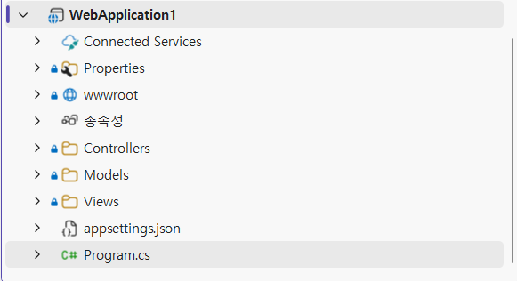

# 2026 닷넷 개발자 비즈니스앱 개발

## 1. 앱 개발 개요

### web
- World Wide Web을 줄여서 부르는 단어
- 인터넷의 목적 : 핵전쟁이 나더라도 데이터를 완전 소실하지 않고 보관하기 위해서 시작
- 인터넷에서 통신 및 데이터를 전달의 어려움
- 1990년 팀 버너스리가 WWW를 발표, 1980년 대부터 연구해온 결과
- XML이 너무 복잡해서 사용이 불편 -> 개량화해서 HTML을 개발
- 2014년 이후 HTML5로 적용 중

### 웹 구조
- Frontend
    - 웹 기술들을 사용해서 사용자가 브라우저에서 볼 수 있는 화면을 개발 영역
- Backend
    - 프론드엔드에 전달할 데이터나 동적인 화면 생성등을 처리해주는 영역

### 프론트엔드 웹 기술
- HTML - HyperText Markup Language의 약자. 링크로 페이지를 이동하는 기술
- CSS - Cascade Style Sheets의 약자. HTML에 디자인을 적용시키는 기술
- JS - JavaScript의 약자. 웹페이지에서 동적인 기능을 추가하기 위한 언어
    - JS기술이 진보해서 현재는 서버개발,앱개발 등 여러방면으로 발전

### 백엔드 웹 기술
- 웹 서버(서비스) 단을 개발하는 기술,프로그래밍 언어별로 구분
- Java - Java Bean,EJB,JSP,Spring,`Spring Boot`
- .NET - ASP(.NET 이전,VBScript) ASP..NET(윈도우만) > ASP.NET Core(멀티 플랫폼)
- Python - Flask(간단한 웹개발),. django(기업 솔류션), FastAPI(오픈 AI)

### 웹 서버,웹 서비스
- 웹 서버 - 프론트엔드 + 백엔드로 사용자가 웹화면을 사용할 수 있도록 서비스
- `웹 서비스` - 백엔드로 데이터만 전달하는 서비스

### 웹을 사용하는 이유
- 설치가 필요없음 - pc 프로그램은 설치파일,모바일 앱은 앱스토어 설치 필요
    - 웹은 URL만 알면 사용가능
- 운영체제 독립적 - 운영을 하면 OS에 관계없이 사용가능
    - WPF는 윈도우 종속적
- 업데이트가 쉬움 - 서버만 내용을 업데이트하면 사용자는 기존과 동일하게 사용만 하면
    - 유지보수 비용이 낮음
- 데이터 공유 - 서버에 존재하는 데이터를 실시간으로 공유가능
    - 데이터포털 OpenAI,카카오톡 네이버지도 구글 드라이브...
- AI와 연결 쉬움 - 대부분의 AI서비스가 웹 API 형태로 제공

## 2. 웹 표준 기술

### HTML 기본
- VS Code에서 로컬 HTML 파일을 서버형식으로 보여주는 플러그인
- 확장에서 Live Server 설치 
- html에서 open with live server를 클릭하면 웹브라우저로 열림


#### HTML 기본구조
- index.html - 대부분 웹 페이지의 첫 페이지 파일
- VS Code,html 파일 생성 후 !,tab키로 HTML 기본 코드 생성

```html
<!DOCTYPE html><!-- 문서가 HTML5 양식 선언 -->
<html lang="en"><!--가장 root 태그 -->
<head>
    <meta charset="UTF-8"><!-- 페이지설정,유니코드 사용-->
    <!-- Responssive Web 사용, 화면 크기에 따라 디자인이 알맞게 변형되는 웹-->
    <meta name="viewport" content="width=device-width, initial-scale=1.0">
    <title>Document</title>
</head>
<body><!-- 웹페이지 표현구역-->

</body>
</html><!--XML과 동일,모든 태그는 <tag></tag>로 구성>
```
- head - 웹페이지 설정할 태그 작성
- body - 웹페이지 표현할 태그 작성

#### HTML 기본 태그
- 마크다운 문법 ->HTML 태그로 변경
- HTML에서는 space,enter 적용안됨

|태그 | 설명 |
|---|---|
|`<html>` | HTML 문서 시작 |
|`<head>` | 문서정보(설정) |
|`<title>` | 브라우저 제목 |
|`<meta>` | 문서 구성정보 |
|`<body>`| 화면에 표시될 내용 |
|`<h1>`~`<h6>`| 제목. 마크다운 #과 동일|
|`<p>` | 문단 표현 |
|`<a>` | anchor의 prefix. 하이퍼링크. 다른페이지로 이동|
|``| 이미지 |
|`<video>`| 동영상 |
|`<source>`| 동영상 위치 태그 |
|`<div>`| 영역 구분. HTML5에서 가장많이 쓰는 태그|
|`<span>`| 인라인 영역 구분 |
|`<ul>`| 순서없는 목록 시작. 마크다운 -와 동일 |
|`<ol>`| 순서있는 목록 시작. 마크다운 1. 와 동일 |
|`<li>`| 두 목록의 실제 항목 |
|`<br>`| 줄바꿈 |
|`<hr>`| 가로선 |
|`<table>`| 표(테이블) 시작 태그 |
|`<tr>`| row. 한줄 태그 |
|`<th>`| header. 표 제목 |
|`<td>`| 한셀 |
|`<iframe>`| html 내 다른 html 소스를 추가하는 기능

- lorem - 화면에 텍스트 꾸미는 작업 도와주는 스니펫
    - lorem20 - 임의 20단어


#### HTML 입력 태그

- HTML에서 사용자 입력을 받기위한 태그

|태그| 설명|
|---|---|
|`<form>`| 입력영역 태그 |
|`<label>`| 라벨 태그 |
|`<button>`| 버튼 태그 |
|`<textarea>`| 멀티라인 텍스트박스 |
|`<select>`| 콤보박스 시작태그 | 
|`<option>`| 콤보박스 목록태그 |
|`<input>`| 가장 중요한 입력태그. type 속성으로 여러 컨트롤로 분기 |

- input 타입 목록

|속성값|예제| 설명|
|---|---|---|
|text | `<input type="text">` | 한 줄 텍스트 입력 |
|password | `<input type="password">` | 비밀번호 입력 |
|email | `<input type="email">` | 이메일주소 입력 |
|number | `<input type="number">` | 숫자 입력 |
|checkbox | `<input type="checkbox">` | 체크박스 |
|radio | `<input type="radio">` | 라디오버튼 |
|file | `<input type="file">` | 파일업로드 |
|date | `<input type="date">` | 날짜선택 |
|hidden | `<input type="hidden">` | 페이지 내 숨김값 |
|submit | `<input type="submit">` | 등록/저장 버튼 |
|button | `<input type="button">` | 일반버튼 |
|reset | `<input type="reset">` | 입력값 초기화버튼 |

- input 중 type, submit, button, reset은 button 태그와 동일
- 웹에서 회원가입, 로그인, 게시판 등록 화면 등에 90%는 위 태그로만 구성


- html에서 id에 같은 값을 써도 컴파일오류 발생 안함. 이런 오류는 개발자 몫

### CSS

#### inputs.html 디자인 바꾸기

- Bootstrap - 트위터에서 개발한 UI library
- 아래 태그를 `<title>` 태그 아래 붙여넣기

```html
<link href="https://cdn.jsdelivr.net/npm/bootstrap@5.3.8/dist/css/bootstrap.min.css" rel="stylesheet" integrity="sha384-sRIl4kxILFvY47J16cr9ZwB07vP4J8+LH7qKQnuqkuIAvNWLzeN8tE5YBujZqJLB" crossorigin="anonymous">
```

- 아래 태그를 `</body>` 위에 붙여넣기

```html
<script src="https://cdn.jsdelivr.net/npm/bootstrap@5.3.8/dist/js/bootstrap.bundle.min.js" integrity="sha384-FKyoEForCGlyvwx9Hj09JcYn3nv7wiPVlz7YYwJrWVcXK/BmnVDxM+D2scQbITxI" crossorigin="anonymous"></script>
```

- 각 태그별 class를 적절하게 입력

```html
<!-- class가 CSS를 적용시키는 속성 -->
<input type="text" name="userId" id="userId" class="form-control">
```


- CSS는 HTML에 디자인을 미려하게 변경하는 기술

- [소스](./webapp/WebTech_basic/css_exam.html)


### Javascript

- 웹페이지(HTML)을 동적으로 변경시켜주는 프로그래밍 언어
- 기본 문법은 C, C++과 동일, 변수지정 등은 Python과 동일
- Typescript, React, Node.js... 활용되는 곳이 매우 많음


#### HTML 연결

- html에 `<script>` 태그 사용해서 내부에 같이 표현하거나, 외부 js 파일을 연결
- 필요한 경우 웹브라우저(Chrome)에서 개발자도구(F12)로 확인할 것


#### 기본 문법

- 변수부터 객체까지 - [소스](./webapp/WebTech_basic/js_exam.html)

#### DOM
- Document Object Model 약자. HTML 트리구조를 객체로 만든 모델
- JS로 접근 가능 - [소스](./webapp/WebTech_basic/js_dom.html)


#### JS 목적

- 웹 페이지 동적으로 만들기. HTML 요소 접근 내용 변경 등
- 사용자와 상호작용. 클릭, 드래그 등 이벤트 처리
- DOM 제어
- 서버와 데이터 통신
- 데이터 처리 및 검증. 입력값 검사, 데이터 가공, 계산 등


## 3. ASP.NET Core

### 개요

- Microsoft에서 개발한 크로스 플랫폼 웹 개발 프레임워크

#### 특징
- 크로스플랫폼 Window/Linux/macOS 지원
- ASP.NET에 비해서 속도가 개선됨
- MVC 패턴 지원
- REST API 개발 가능
- EntityFramework (DB ORM) 기능 지원 - 쿼리문 없이 DB핸들링

#### 개발분야
- 홈페이지,쇼핑몰,ERP/MES/스마트팩토리, 그룹웨어,REST API 서비스,Iot데이터서버,AI 서버,게임서버

### 사용법

#### Visual Studio 활용법

- VS 오픈 
- 프로젝트 형식 웹 선택
- 웹앱 템플릿 중 ASP.NET Core 선택
- 
- 

#### ASP.NET Core MVC 패턴 구성
- 

- Connected Service - 외부 클라우드 서비스 연결을 관리(API를 써도 잘 사용안함)
- Properties - 프로젝트 실행 및 빌드 환경 설정
    - launchSettings.json - 실행 포트, 로그 출력 설정을 관리
- wwwroot - 정적파일(일반 html,css,js,image) 프론트엔드 웹용 파일 위치
- 종속성 - 패키지,NuGet 패키지 내부/외부 라이브러리

- 핵심 패턴
    - Controller - 사용자의 요청(대부분 url)을 가장 먼저 받아서 처리하는 영역 
        - 필요한 데이터는 Models에서 화면은 Views에서 그려서 전달해주는 역활
    - Models - 데이터 구조 클래스,비즈니스 로직 등을 정의하고 처리하는 곳
    - Views - 사용자에게 실제로 보여지는 화면 담당
        - `*.cshtml` - 기본 HTML 소스에 C# 로직이 섞여있는 html파일 `Razor` 뷰
- appsettings.json - 애플리케이션 환경 설정, DB연결문자열,로깅수준 변경
- program.cs - 웹앱 시작점(Entry Point)
    - 웹서버 구동에 필요한 서비스 등록,사용자 요청 라우팅 구성
- 

- program.cs
```cs
public static void Main(string[] args)
{
    var builder = WebApplication.CreateBuilder(args);

    // Add services to the container.
    builder.Services.AddControllersWithViews();

    var app = builder.Build();

    // Configure the HTTP request pipeline.
    if (!app.Environment.IsDevelopment())
    {
        app.UseExceptionHandler("/Home/Error");
        // The default HSTS value is 30 days. You may want to change this for production scenarios, see https://aka.ms/aspnetcore-hsts.
        app.UseHsts();
    }

    app.UseHttpsRedirection();
    app.UseRouting();

    app.UseAuthorization();

    app.MapStaticAssets();
    app.MapControllerRoute(
        name: "default",
        pattern: "{controller=Home}/{action=Index}/{id?}")
        .WithStaticAssets();

    app.Run();
}
```

- URL 규칙(라우팅) 
    - `{controller=Home}/{action=Index}/{id?}` == `{controller}/{action}/{id?} `
    - /Home/Index/3 --> https://localhost:port/Home/Index/3 
    - HomeController 클래스에 Index 액션 메서드에 파라미터를 3을 넣어서 실행하라는 의미

- HomeController.cs - Home 뒤에 Controller는 실행시 무시
    ```cs
    public class HomeController : Controller
    {
        public IActionResult Index()
        {
            return View();
        }
    }
    ```
- Views - 화면영역
    - 
    - `return Viem()` 에서 Index.cshtml을 렌더링해서 리턴
    - html 전체 소스는 없음 `main 화면 영역`만 존재

    - Shared 폴더 - 모든 View가 함께 공유하는 공통화면
        - Layout.cshtml - 웹사이트 공통화면 틀 `html 전체소스` 포함

#### 시맨틱웹 태그 리스트

- HTML 기본외 화면 구성위해서 추가로 만든 구역태그
- 웹 페이지를 구성할 때 단순히 디자인만을 위해 태그를 사용하는 것이 아니라, 개발자가 의도한 요소의 역할과 의미가 명확히 드러나도록 작성하는 방식
- `<div>` 태그로 대체할 수 있음

|태그 | 설명 |
|---|---|
|`<header>`| 웹 페이지에 머릿글을 담당 |
|`<main>`| 웹 페이지의 핵심 콘텐츠 영역 |
|`<footer>`| 웹 페이지 하단 영역(저작권, 연락처 등) |
|`<nav>`| 내비게이션 링크 모음 영역 |
|`<section>`| 주제별 콘텐츠 그룹 구역 |
|`<article>`| 독립적으로 배포 가능한 콘텐츠(게시글, 뉴스 등) |
|`<aside>`| 본문과 간접적으로 관련된 사이드 영역 |
|`<figure>`| 이미지, 도표 등 미디어 콘텐츠 묶음 |
|`<figcaption>`| figure 태그의 캡션(설명) |
|`<details>`| 열고 닫을 수 있는 추가 정보 영역 |
|`<summary>`| details 태그의 제목 |
|`<mark>`| 강조(하이라이트) 텍스트 |
|`<time>`| 날짜/시간 표현 |

#### ASP.NET Core 메뉴/기능 추가

1. Controller 폴더 > Context Menu > 추가 > 컨트롤러

    

    

2. BoardController.cs, Index() 액션메서드 > Context Menu > 뷰 추가

    

    
        
    

    

3. _Layout.cshtml에 메뉴 추가

    ```html
    <li class="nav-item">
        <a class="nav-link text-dark" asp-area="" asp-controller="Board" asp-action="Index">게시판</a>
    </li>
    ```

4. Board > Index.cshtml 편집

    


#### DB 핸들링 

- MySQL bookrentalshop 연동
- MySQL Connector 대신 EntityFramework Core 사용

1. NuGet 패키지 설치
    - **EntityFramework는 Major 버전 숫자가 일치해야 함**
    - Pomelo..와 Microsoft.. 버전 일치
    - Microsoft.EntityFrameworkCore `9.0.17`
    - Microsoft.EntityFrameworkCore.Tools `9.0.17`
    - Pomelo.EntityFrameworkCore.MySql `9.0.0`

2. appsettings.json - [소스](./webapp/WebApplication1/appsettings.json)
    - 연결문자열 추가

    ```json
    "AllowedHosts": "*",
    "ConnectionStrings": {
    "BookRentalShopConnection": "Server=localhost;Port=3306;Database=bookrentalshop;User Id=root;Password=my123456;Charset=utf8mb4;"
    }
    ```

3. Model 생성 - NuGet 콘솔 명령어 생성 vs 직접 코딩
    - Book.cs 작성 - [소스](./webapp/WebApplication1/Models/Book.cs)

4. DbContext 생성 - EF 에서 매핑사용할 Db집합 구성
    - MySqlDbContext.cs 작성 - [소스](./webapp/WebApplication1/Models/MySqlDbContext.cs)

5. Program.cs DB로직 추가 - builder 객체에 연결
    - DB연결 문자열, DbContext 를 연결 - [소스](./webapp/WebApplication1/Program.cs)

6. Controller 생성 - Db와 연결할 컨트롤러
    - context menu > 추가 > 컨트롤러
    
    

    

    - 데이터베이스 공급자 문제, MySQL 없어서 SQL Server 관련 설정 자동 추가
    - NuGet 패키지 버전 변경, appsettings.json 연결문자열 삭제

7. _Layout.cshtml 메뉴 추가

8. 오류사항
    - Book`s`Controller -> BookController 모델명에 s 쓰지 말것
    - Routing URL에서 /controller/action/id? 인데 MySQL Key값이 book_idx. id 매핑불가. book_idx -> id로 변경
    - DB모델링 시 PK이름을 id로 고정할 것
    - BookController.cs 에 메서드 파라미터 bookidx -> id로 변경. Ctrl+H 변경할 때 대소문자 구분 클릭.


9. 현재 웹개발 DB연동 Mapping기술
    - ASP.NET Core(C#) - EntityFrameworkCore
    - SpringBoot(Java) - JPA
    - 실무에서 아주 많이 쓰이지는 않음

#### HTTP 메서드

웹브라우저(클라이언트)와 서버가 데이터를 주고받는 대표적인 HTTP 메서드(요청방식)

- GET: 데이터를 가져올때 사용
    - URL로 요청
        - https://localhost:port/Book/Detail/7
        - https://apis.data.go.kr/idnum/servicename/getFestivalKr?serviceKey=servicekey&pageNo=1&numOfRows=10&resultType=json
    - 데이터 노출위험, 길이제한 단점. 일반적인 요청방식

- POST : 데이터 처리 수행/변경/삭제시 사용
    - URL에 데이터를 붙이지 않고, 눈에 보이지 않는 HTTP body에 데이터를 숨겨서 전송
    - submit 타입버튼 클릭했을 때 실행 또는 submit을 수동을 발생시킬때
    - 데이터 노출위험 적음, 길이제한 없음. 일반적인 데이터처리 방식 

### ASP.NET Core RESTAPI

- 웹페이지 화면없이 데이터만 서비스 형태
- 웹페이지는 다른 웹/앱기술로 개발가능
    - Node.js, React, WPF, 안드로이드 등 여러 앱을 개발
- 데이터포털에서 OpenAPI 서비스와 같은 웹서비스 구축

#### products 테이블 생성

- testdb 데이터베이스에 products 생성

```sql
-- 테이블
CREATE TABLE products (
    product_id INT NOT NULL AUTO_INCREMENT,
    product_name VARCHAR(100) NOT NULL,
    category VARCHAR(50) NULL,
    price DECIMAL(10,0) NOT NULL,
    stock INT NOT NULL,
    created_at DATETIME DEFAULT CURRENT_TIMESTAMP,
    PRIMARY KEY (product_id)
);

-- 더미데이터
INSERT INTO products(product_name, category, price, stock)
VALUES
('무선 마우스', '전자기기', 55000, 30),
('기계식 키보드', '전자기기', 89000, 15),
('텀블러', '생활용품', 18000, 50),
('노트북 거치대', '사무용품', 32000, 20),
('핸드폰 충전기', '전자기기', 18000, 10);
```

#### ASP.NET Core 웹 API 프로젝트 생성

- ASP.NET Core 웹 API 템플릿 선택. 
- 나머지 동일. OpenAPI 지원 사용, 컨트롤러 사용 체크 만들기
- wwwroot(js, css정적파일), Views 폴더 없음
- Models 폴더는 직접 생성


#### Postman 설치

- https://www.postman.com/downloads/ 


#### MySqlConnector NuGet 패키지 설치

- NuGet 패키지 관리자 > MySqlConnector 검색 후 설치

#### Product 모델 클래스 생성

- Models > Product.cs 생성 - [소스](./webapp/WebApiSolution/ProductApi/Models/Product.cs)

#### DB 연결 구성

- appsettings.json 연결문자열 추가 - [소스](./webapp/WebApiSolution/ProductApi/appsettings.json)
- Program.cs 연결변수 추가 - [소스](./webapp/WebApiSolution/ProductApi/Program.cs)

#### ProductsController 생성

- Controller / ProductsController.cs 생성 - [소스](./webapp/WebApiSolution/ProductApi/Controllers/ProductsController.cs)

#### GET - 상품 리스트 조회

- Get 메서드 작성

##### 실행결과


#### 일반메서드 vs 비동기메서드

- 일반메서드 - DB처리가 완료될때까지 나머지 로직이 중지
```cs
[HttpGet]  // GET 메서드 선언(없어도 기본)
public IActionResult GetProducts() {
    List<Product> products = new(); // new List<Product>(); 와 동일기능

    using var conn = new MySqlConnection(connString);
    conn.Open();

    string query = @"
         SELECT product_id, product_name, category, price, stock, created_at
           FROM products
          ORDER BY product_id DESC 
         ";  // 여러줄 문자열 @" 또는 """

    using var cmd = new MySqlCommand(query, conn);
    using var reader = cmd.ExecuteReader(); 

    while (reader.Read()) {
        Product product = new Product {
            ProductId = reader.GetInt32("product_id"),
            ProductName = reader.GetString("product_name"),
            Category = reader.GetString("category"),
            Price = reader.GetDecimal("price"),
            Stock = reader.GetInt32("stock"),
            CreatedAt = reader.GetDateTime("created_at")
        };

        products.Add(product);
    }
    return Ok(products);
}
```

- 비동기 메서드 - 백그라운드로 동작, 다른 기능 사용


```csharp
[HttpGet]  // GET 메서드 선언(없어도 기본)
public async Task<IActionResult> GetProductsAsync() {
    ...
    await conn.OpenAsync();

    ... 
    using var reader = await cmd.ExecuteReaderAsync(); 

    while (await reader.ReadAsync()) {
        ...
    }
    return Ok(products);
}
```

- GET /api/products 

#### GET - 상품 단건 조회

- ProductsController에 단건 조회용 메서드 생성

- GET /api/products/id

##### 실행결과


- 성공화면


- 실패화면


- 포스트맨 결과화면

- 공공데이터포털 기능은 대부분 여기까지

#### POST - 상품 등록 

- ProductsController에 단건 등록 메서드 생성
- POST /api/products

#### PostMan에서 테스트

- GET 메서드 이외는 웹브라우저에서 테스트 매우 어려움
- Swagger, Postman 등의 테스트 툴 사용 거의 필수

##### 실행결과


- Postman Post메서드 선택, Body > raw > json 데이터 입력, Send
- Response 결과 맨아래 확인


- DB 입력 화면

#### Command Execute 비교

|메서드|사용방법|
|---|---|
|ExecuteReader() | SELECT 여러 행 조회 |
|ExecuteNonQuery() | INSERT, UPDATE, DELETE 실행 |
|ExecuteScalar() | 값 1개 반환(COUNT, MAX/MIN, LAST_INSERT_ID 등) |

- 비동기는 ~Async() 로 작성할 것
 
#### PUT - 상품 수정

- POST 메서드로 구현 가능

- PUT /api/products/id

##### 실행결과


- Postman 결과화면


- Database 결과확인

- Postman에서 GET으로 변경하고 Send 확인

#### PATCH - 필요컬럼 수정

- POST 메서드로 구현 가능. 기능을 완전 분리하고 싶을때 사용
- PATCH /api/products/id
- 재고만 수정하거나 카테고리만 수정하고 싶은 기능을 추가하고자 할때

- Models Product.cs를 복사해서 ProductStock.cs로 변경
- [HttpPatch("{id}/stock")] 로 URL 변경

##### 실행결과


- PATCH 메서드에 맞게 URL 변경

#### DELETE - 상품 삭제

- DELETE /api/products/id
- HttpDelete 메서드 추가

##### 실행결과


- 삭제 확인


- 데이터베이스 확인

#### HEAD, OPTIONS

- 웹서비스 사용 여부 확인
- 웹서비스에 지원하는 메서드 확인

##### 실행결과


- HttpHead 결과화면


- HttpOptions 결과화면

#### HttpMethod

- [HttpMethod("GET")], [HttpMethod("POST")] 등으로 명시적으로 사용
- 거의 사용안 함

### RESTAPI 서비스 사용 애플리케이션

- 하나의 웹 서비스를 가지고 여러 종류 애플리케이션에서 사용

#### CORS 설정

- Cross Origin Resource Sharing 교차 출처 자원 공유. 서버가 다른 곳 같에 데이터 요청을 안전하게 하도록 허용해주는 설정
- Program.cs 추가

#### HTML + Javascript 

- product-client.html 생성
- HTML, Javascript 구현 

##### 실행결과


- 일반 조회결과


- 부트스트랩 기본적용 결과


- 부트스트랩 일괄적용 화면

#### WPF 1

- 공공데이터포털 부산축제정보 앱 WPF 활용
- 부산축제정보 앱 다운사이징 코딩

##### 실행결과


- HTML + Javascript 실행결과 동일


- WPF 등록화면 및 성공메시지


- HTML + Javascript 에서 추가된 데이터 확인 화면

#### 현재 상품등록 문제

- 입력 Validation Check 구현되어 있지 않음


- ""(empty)는 null이 아니기 때문에 데이터 등록됨


- 데이터베이스에 빈 데이터 입력확인

- 데이터 입력 시 무조건(!) 입력 검증 로직 필요

#### WPF 2


- Validation Check, Exception Handling 추가
- 수정(PUT), 삭제(DELETE) 기능 구현

#### 디자인 렌더링 오류


- xaml 파일을 복사한 뒤 클래스명이 중복되어서 발생
- 새로 만든 xaml 파일의 클래스명을 전부 수정


#### 현재 구현의 문제

- ProductCreateWindow.xaml와 ProductEditWindow.xaml 가 존재
- DB 설계 상 새로운 컬럼이 추가되면 두 화면을 모두 수정
- 하나의 윈도우로 개발하면 한 화면만 수정의 효율성
- ProductCreateWindow.xaml,ProductEditWindow.xaml -> ProductWindow.xaml 로 통합
- 각 창의 필수기능, BtnSave 버튼 주요 로직만 조건에 따라 합치기

```cs
if (_product is null) { // 신규 생성. ProductCreateWindow BtnSave 기능
    Product product = new Product {
        ProductName = TxtProductName.Text.Trim(),
        Category = TxtCategory.Text.Trim(),
        Price = Convert.ToDecimal(NudPrice.Value),
        Stock = Convert.ToInt32(NudStock.Value)
    };

    bool result = await service.PostProductAsync(product);  // 서비스에 메서드 추가

    if (result) {
        await this.ShowMessageAsync("저장", "상품이 등록되었습니다.");
        DialogResult = true;
        Close();
    } else {
        await this.ShowMessageAsync("저장", "상품 등록이 실패했습니다.");
    }
} else { // 수정. ProductEditWindow BtnSave 기능
    // 이전 원본 객체를 수정
    _product.ProductName = TxtProductName.Text.Trim();
    _product.Category = TxtCategory.Text.Trim();
    _product.Price = price;
    _product.Stock = stock;

    bool result = await service.UpdateProductAsync(_product);

    if (result) {
        await this.ShowMessageAsync("저장", "상품이 수정되었습니다.");
        DialogResult = true;
        Close();
    } else {
        await this.ShowMessageAsync("저장", "상품 수정에 실패했습니다.");
    }
}
```

##### 결론


- 기존 방식 - WPF에 DB 핸들링위해서 SQL 처리, 웹개발(ASP.NET 포함)때도 DB 핸들링 SQL 처리 필요
- REST API 방식 - DB 핸들링은 REST API 서비스에서 통합개발. 각 클라이언트에서는 서비스URL 호출(요청)으로 데이터를 처리

### Unity + RESTAPI 애플리케이션

- Unity URP 프로젝트 생성

#### Newtonsoft Json 패키지 설치

- Window > Package Manger > + Add package by technical name > 
    - `com.unity.nuget.newtonsoft-json` 입력 후 Install


#### Canvas UI 추가

- Canvas 추가. 2D변경 
- Button 추가 -> BtnLoad
- 나눔고딕 폰트 추가, 이전 파일 그대로 사용


- Text - TextMeshPro 추가 -> Logs 

#### Script 작성

- ProductApiClient.cs 생성 

```cs
public class ProductApiClient : MonoBehaviour {
    [SerializeField]
    private TMP_Text txtLog;

    [SerializeField]
    private string serviceUrl = "http://localhost:5276/api/products";

    public void LoadProducts() {
        StartCoroutine(GetProducts());
    }

    private IEnumerator GetProducts() {
        using UnityWebRequest request = UnityWebRequest.Get(serviceUrl);

        yield return request.SendWebRequest();

        if (request.result != UnityWebRequest.Result.Success) {
            txtLog.text = request.error;
            yield break;
        }

        txtLog.text = request.downloadHandler.text;
    }
}
```

#### GameObject 연결

- 빈 객체 -> ProductApiManager 생성
- ProductApiClient 스크립트를 하위 컴포넌트 등록
- TxtLog 변수에 캔버스에 추가한 Logs 텍스트 할당


- BtnLoad OnClick 이벤트 추가


- 스크립트의 부모 객체 ProductApiManager를 기본으로 선택
- 실제 사용함수는 ProdctApiClient.LoadProduct() 선택

#### 실행화면


- API 서버 중지시 화면


- API 서버 정상동작 화면


- WPF에서 데이터 등록 후 Unity에서 재확인

#### 데이터 리스트화면(2D) 만들기


- 화면 구조


- Panel - HeaderPanel, ButtonPanel, DataGridHeader
- TMPro - HeaderTitle, Lbl~ 6개
- Button - BtnLoad
- ScrollView

- Product.cs 스크립트 생성 - [소스](./unity/UnityProductApp/Assets/Scripts/Product.cs)

#### ProductRow 프리팹


- ProductRow 객체 생성, UI 구성


- Prefabs 폴더 드래그, 프리팹 생성

- ProductRowUi.cs 스크립트 생성

- ProductRow 프리팹 더블클릭 > 프리팹 에디터 화면 전환
- ProductRowUi.cs 를 ProductRow root 객체 할당


#### ProductApiClient 스크립트 수정

- 스크롤뷰 컨텐츠, ProductRow 프리팹 할당 추가 - [소스](./unity/UnityProductApp/Assets/Scripts/ProductApiClient.cs)

#### ProductApiManager 아래 스크립트

- ProductApiClient 스크립트에 Content, Product Row 프리팹 할당


#### 실행결과


- 컨텐츠 아래 첫번째 줄에 모두 겹쳐져서 출력

#### 프리팹 및 컨텐트 수정

- ProductRow 프리팹 오픈
- Add Component > Layout Element 추가
- Min Height, Preferred Height 36 지정
- Flexibl Height 0 지정

- View port > cotent 클릭


#### 실행결과


- WPF에서 신규 데이터 입력


- Unity에서 신규 데이터 확인


## 4. ASP.NET Core 도커


## [토이프로젝트](./README5.md)
