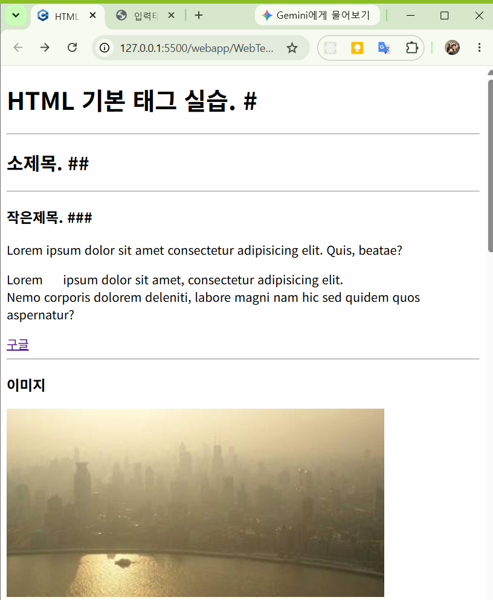
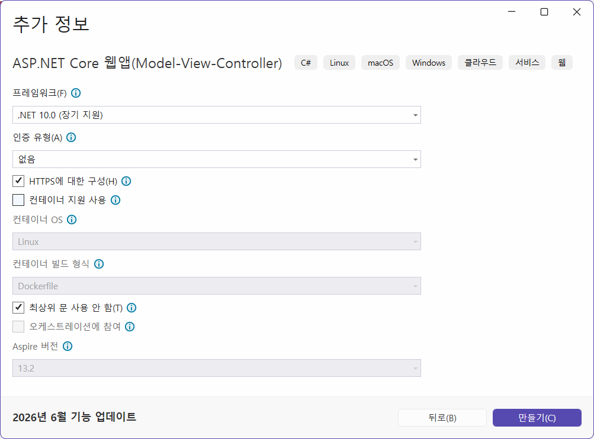

# 2026 닷넷 개발자 비즈니스앱 개발

## 1. 앱 개발 개요

### web
- World Wide Web을 줄여서 부르는 단어
- 인터넷의 목적 : 핵전쟁이 나더라도 데이터를 완전 소실하지 않고 보관하기 위해서 시작
- 인터넷에서 통신 및 데이터를 전달의 어려움
- 1990년 팀 버너스리가 WWW를 발표, 1980년 대부터 연구해온 결과
- XML이 너무 복잡해서 사용이 불편 -> 개량화해서 HTML을 개발
- 2014년 이후 HTML5로 적용 중

### 웹 구조
- Frontend
    - 웹 기술들을 사용해서 사용자가 브라우저에서 볼 수 있는 화면을 개발 영역
- Backend
    - 프론드엔드에 전달할 데이터나 동적인 화면 생성등을 처리해주는 영역

### 프론트엔드 웹 기술
- HTML - HyperText Markup Language의 약자. 링크로 페이지를 이동하는 기술
- CSS - Cascade Style Sheets의 약자. HTML에 디자인을 적용시키는 기술
- JS - JavaScript의 약자. 웹페이지에서 동적인 기능을 추가하기 위한 언어
    - JS기술이 진보해서 현재는 서버개발,앱개발 등 여러방면으로 발전

### 백엔드 웹 기술
- 웹 서버(서비스) 단을 개발하는 기술,프로그래밍 언어별로 구분
- Java - Java Bean,EJB,JSP,Spring,`Spring Boot`
- .NET - ASP(.NET 이전,VBScript) ASP..NET(윈도우만) > ASP.NET Core(멀티 플랫폼)
- Python - Flask(간단한 웹개발),. django(기업 솔류션), FastAPI(오픈 AI)

### 웹 서버,웹 서비스
- 웹 서버 - 프론트엔드 + 백엔드로 사용자가 웹화면을 사용할 수 있도록 서비스
- `웹 서비스` - 백엔드로 데이터만 전달하는 서비스

### 웹을 사용하는 이유
- 설치가 필요없음 - pc 프로그램은 설치파일,모바일 앱은 앱스토어 설치 필요
    - 웹은 URL만 알면 사용가능
- 운영체제 독립적 - 운영을 하면 OS에 관계없이 사용가능
    - WPF는 윈도우 종속적
- 업데이트가 쉬움 - 서버만 내용을 업데이트하면 사용자는 기존과 동일하게 사용만 하면
    - 유지보수 비용이 낮음
- 데이터 공유 - 서버에 존재하는 데이터를 실시간으로 공유가능
    - 데이터포털 OpenAI,카카오톡 네이버지도 구글 드라이브...
- AI와 연결 쉬움 - 대부분의 AI서비스가 웹 API 형태로 제공

## 2. 웹 표준 기술

### HTML 기본
- VS Code에서 로컬 HTML 파일을 서버형식으로 보여주는 플러그인
- 확장에서 Live Server 설치 
- html에서 open with live server를 클릭하면 웹브라우저로 열림


#### HTML 기본구조
- index.html - 대부분 웹 페이지의 첫 페이지 파일
- VS Code,html 파일 생성 후 !,tab키로 HTML 기본 코드 생성

```html
<!DOCTYPE html><!-- 문서가 HTML5 양식 선언 -->
<html lang="en"><!--가장 root 태그 -->
<head>
    <meta charset="UTF-8"><!-- 페이지설정,유니코드 사용-->
    <!-- Responssive Web 사용, 화면 크기에 따라 디자인이 알맞게 변형되는 웹-->
    <meta name="viewport" content="width=device-width, initial-scale=1.0">
    <title>Document</title>
</head>
<body><!-- 웹페이지 표현구역-->

</body>
</html><!--XML과 동일,모든 태그는 <tag></tag>로 구성>
```
- head - 웹페이지 설정할 태그 작성
- body - 웹페이지 표현할 태그 작성

#### HTML 기본 태그
- 마크다운 문법 ->HTML 태그로 변경
- HTML에서는 space,enter 적용안됨

|태그 | 설명 |
|---|---|
|`<html>` | HTML 문서 시작 |
|`<head>` | 문서정보(설정) |
|`<title>` | 브라우저 제목 |
|`<meta>` | 문서 구성정보 |
|`<body>`| 화면에 표시될 내용 |
|`<h1>`~`<h6>`| 제목. 마크다운 #과 동일|
|`<p>` | 문단 표현 |
|`<a>` | anchor의 prefix. 하이퍼링크. 다른페이지로 이동|
|``| 이미지 |
|`<video>`| 동영상 |
|`<source>`| 동영상 위치 태그 |
|`<div>`| 영역 구분. HTML5에서 가장많이 쓰는 태그|
|`<span>`| 인라인 영역 구분 |
|`<ul>`| 순서없는 목록 시작. 마크다운 -와 동일 |
|`<ol>`| 순서있는 목록 시작. 마크다운 1. 와 동일 |
|`<li>`| 두 목록의 실제 항목 |
|`<br>`| 줄바꿈 |
|`<hr>`| 가로선 |
|`<table>`| 표(테이블) 시작 태그 |
|`<tr>`| row. 한줄 태그 |
|`<th>`| header. 표 제목 |
|`<td>`| 한셀 |
|`<iframe>`| html 내 다른 html 소스를 추가하는 기능

- lorem - 화면에 텍스트 꾸미는 작업 도와주는 스니펫
    - lorem20 - 임의 20단어


#### HTML 입력 태그

- HTML에서 사용자 입력을 받기위한 태그

|태그| 설명|
|---|---|
|`<form>`| 입력영역 태그 |
|`<label>`| 라벨 태그 |
|`<button>`| 버튼 태그 |
|`<textarea>`| 멀티라인 텍스트박스 |
|`<select>`| 콤보박스 시작태그 | 
|`<option>`| 콤보박스 목록태그 |
|`<input>`| 가장 중요한 입력태그. type 속성으로 여러 컨트롤로 분기 |

- input 타입 목록

|속성값|예제| 설명|
|---|---|---|
|text | `<input type="text">` | 한 줄 텍스트 입력 |
|password | `<input type="password">` | 비밀번호 입력 |
|email | `<input type="email">` | 이메일주소 입력 |
|number | `<input type="number">` | 숫자 입력 |
|checkbox | `<input type="checkbox">` | 체크박스 |
|radio | `<input type="radio">` | 라디오버튼 |
|file | `<input type="file">` | 파일업로드 |
|date | `<input type="date">` | 날짜선택 |
|hidden | `<input type="hidden">` | 페이지 내 숨김값 |
|submit | `<input type="submit">` | 등록/저장 버튼 |
|button | `<input type="button">` | 일반버튼 |
|reset | `<input type="reset">` | 입력값 초기화버튼 |

- input 중 type, submit, button, reset은 button 태그와 동일
- 웹에서 회원가입, 로그인, 게시판 등록 화면 등에 90%는 위 태그로만 구성


- html에서 id에 같은 값을 써도 컴파일오류 발생 안함. 이런 오류는 개발자 몫

### CSS

#### inputs.html 디자인 바꾸기

- Bootstrap - 트위터에서 개발한 UI library
- 아래 태그를 `<title>` 태그 아래 붙여넣기

```html
<link href="https://cdn.jsdelivr.net/npm/bootstrap@5.3.8/dist/css/bootstrap.min.css" rel="stylesheet" integrity="sha384-sRIl4kxILFvY47J16cr9ZwB07vP4J8+LH7qKQnuqkuIAvNWLzeN8tE5YBujZqJLB" crossorigin="anonymous">
```

- 아래 태그를 `</body>` 위에 붙여넣기

```html
<script src="https://cdn.jsdelivr.net/npm/bootstrap@5.3.8/dist/js/bootstrap.bundle.min.js" integrity="sha384-FKyoEForCGlyvwx9Hj09JcYn3nv7wiPVlz7YYwJrWVcXK/BmnVDxM+D2scQbITxI" crossorigin="anonymous"></script>
```

- 각 태그별 class를 적절하게 입력

```html
<!-- class가 CSS를 적용시키는 속성 -->
<input type="text" name="userId" id="userId" class="form-control">
```


- CSS는 HTML에 디자인을 미려하게 변경하는 기술

- [소스](./webapp/WebTech_basic/css_exam.html)


### Javascript

- 웹페이지(HTML)을 동적으로 변경시켜주는 프로그래밍 언어
- 기본 문법은 C, C++과 동일, 변수지정 등은 Python과 동일
- Typescript, React, Node.js... 활용되는 곳이 매우 많음


#### HTML 연결

- html에 `<script>` 태그 사용해서 내부에 같이 표현하거나, 외부 js 파일을 연결
- 필요한 경우 웹브라우저(Chrome)에서 개발자도구(F12)로 확인할 것


#### 기본 문법

- 변수부터 객체까지 - [소스](./webapp/WebTech_basic/js_exam.html)

#### DOM
- Document Object Model 약자. HTML 트리구조를 객체로 만든 모델
- JS로 접근 가능 - [소스](./webapp/WebTech_basic/js_dom.html)


#### JS 목적

- 웹 페이지 동적으로 만들기. HTML 요소 접근 내용 변경 등
- 사용자와 상호작용. 클릭, 드래그 등 이벤트 처리
- DOM 제어
- 서버와 데이터 통신
- 데이터 처리 및 검증. 입력값 검사, 데이터 가공, 계산 등


## 3. ASP.NET Core

### 개요

- Microsoft에서 개발한 크로스 플랫폼 웹 개발 프레임워크

#### 특징
- 크로스플랫폼 Window/Linux/macOS 지원
- ASP.NET에 비해서 속도가 개선됨
- MVC 패턴 지원
- REST API 개발 가능
- EntityFramework (DB ORM) 기능 지원 - 쿼리문 없이 DB핸들링

#### 개발분야
- 홈페이지,쇼핑몰,ERP/MES/스마트팩토리, 그룹웨어,REST API 서비스,Iot데이터서버,AI 서버,게임서버

### 사용법

#### Visual Studio 활용법

- VS 오픈 
- 프로젝트 형식 웹 선택
- 웹앱 템플릿 중 ASP.NET Core 선택
- 
- 

#### ASP.NET Core MVC 패턴 구성


## 4. 웹 실습 프로젝트

### IoT 스마트홈 통합 플랫폼

- MQTT WPF + Unity + WebAPI 연동

### 공공데이터 통합 플랫폼

- OpenAPI 서비스 + WPF 연동

### 스마트팩토리 MES 미니 플랫폼

### AI 비전 검사 시스템

### 실시간 채팅 시스템 + 챗봇 기능
