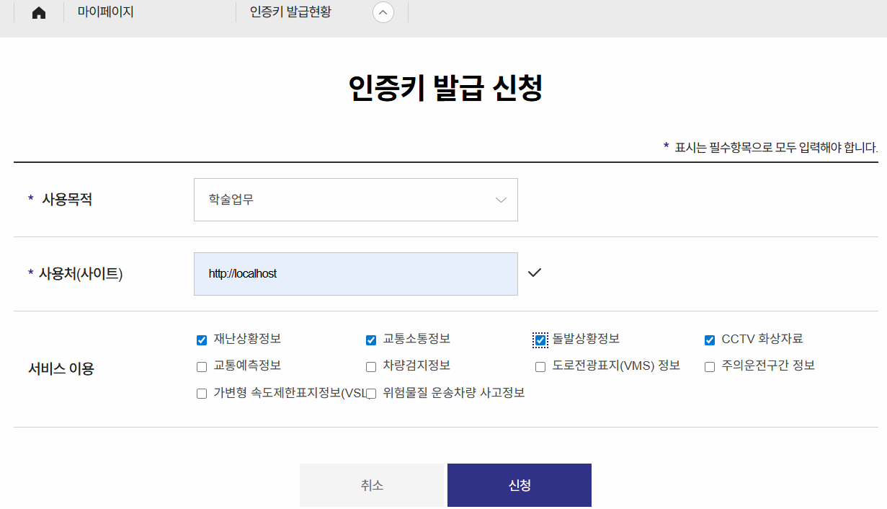
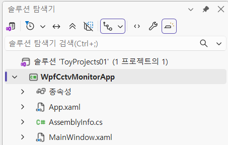
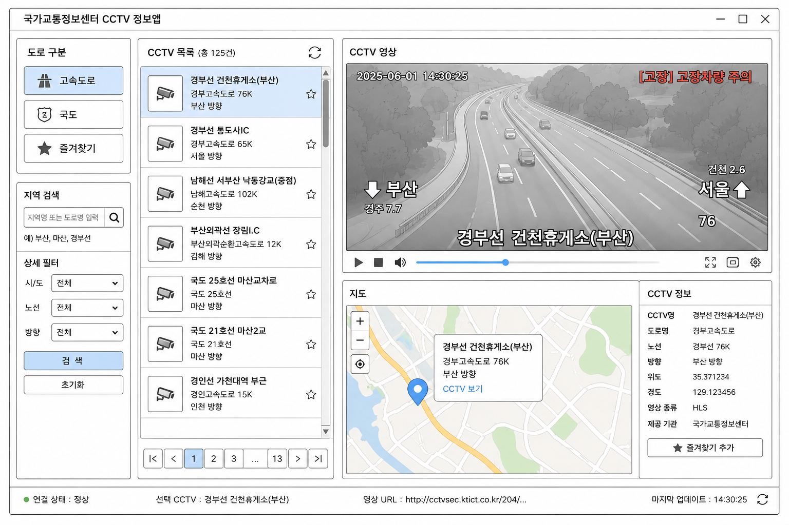

# 웹 통합 토이 프로젝트

## 국가교통정보센터 CCTV 정보앱

### 개요
국가교통정보에서 제공하는 OpenAPI를 통합하여 운영하는 RESTAPI서비스와 모니터링 앱 통합개발
- 국가교통정보센서 OpenAI,경찰청 도시교통정보센터 OpenAI 통합해서 사용 가능0

### 사용기술 
- C# 14(.NET 10.0)
- WPF
- ProgressBar?
- Newtonsoft.json
- LibVLCSharp.WPF
- ITS 국가교통정보센터 OpenAPI [링크](https://www.its.go.kr/)
- MahApps.Metro? WPF UI?

### 개발환경 설정

#### 국가교통정보센터 사이트 회원가입

#### 로그인 후 인증키 발급
- CCTV화상자료 신청
- 
#### 마이페이지 확인

#### Visual studio

##### WPF 앱 프로젝트 생성
- 

#### 동영상 플레이 라이브러리
- 실시간 스트리밍(HLS), 동영상(mp4) 모두 재생이 가능한 라이브러리 필요
- WPF MediaElement - HLS 재생 어려움, 동영상 재생 가능,별도 이미지 처리
- WebView2 - HLS 확인 필요,동영상 재생 가능,별도 이미지 처리
- FFME - HLS가능,동영상 가능,이미지 별도
- LibVLCSharp - HLC,mp4가능, 이미지 별도

##### VLC
- VideoLAN Organization에서 제공하는 크로스 플랫폼 멀티미디어 재생툴

##### NuGet 패키지 설치

- Newtonsoft.Json 
- LibVLCSharp.WPF

### 화면 UI

#### 와이어프레임
- 

### 기본 구현

#### 메인화면 디자인

#### 앱 구조 설계
- Common - 공통 함수나 공통 변수 네임스페이스(폴더)
- Models - OpenAPI Json 데이터 구조 모델 클래스 네임스페이스
- Services - OpenAPI 서비스 동작 클래스 네임스페이스

##### 앱 구조별 구현
- Common/AppCommon.cs - [소스](./toyproject/ToyProjects01/WpfCctvMonitorApp/Common/AppCommon.cs)
- Model/CctvInfo.cs - [소스](./toyproject/ToyProjects01/WpfCctvMonitorApp/Models/CctvInfo.cs)
- Services/CctvService.cs - [소스](./toyproject/ToyProjects01/WpfCctvMonitorApp/Services/CctvService.cs)

##### 비즈니스 로직에 구현
1. 고속도로 선택
2. 지역 검색 - 지역별 최소,최대 위도와 경도 확인
3. 상태필터 - 시/도,노선,방향...
4. 검색 - OpenAPI URL로 위경도 범위별 CCTV 조회
5. CCTV목록 - 리스트
6. 리스트아이템 클릭 - CCTV영상 플레이
7. 지도 영역 - CCTV위치 지도위표시
8. CCTV 정보 - json 결과 추출 표시 
